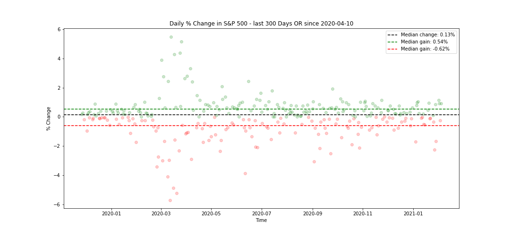

## Big or Small? Changes in the S&P 500

As a passive investor in the S&P 500, I tend to check the index around twice a day. 

When looking at the daily change, however, I never fully understood what numerical value constituted a 'big' change. I always assumed a 1% gain or loss was a lot, but this assumtion was based on feel and not data. 

I decided to create a tool that showed the user daily % change in the S&P 500 for a period of time of their choosing. The tool also tells the user what the median change for this time period was, so they are able to gague for themselves where the line between 'big' and 'small' is.

The tool, having already downloaded data from [Yahoo Finance](https://finance.yahoo.com/quote/%5EGSPC/history?period1=-1325635200&period2=1612483200&interval=1d&filter=history&frequency=1d&includeAdjustedClose=true), does the following things:

* converts data into a Pandas DataFrame
* Drops and cleans necessary columns
* Calculates daily % change
* Finds the median daily changes for days where the index gained, fell, and both. 

Below is a screenshot of a sample output. 

